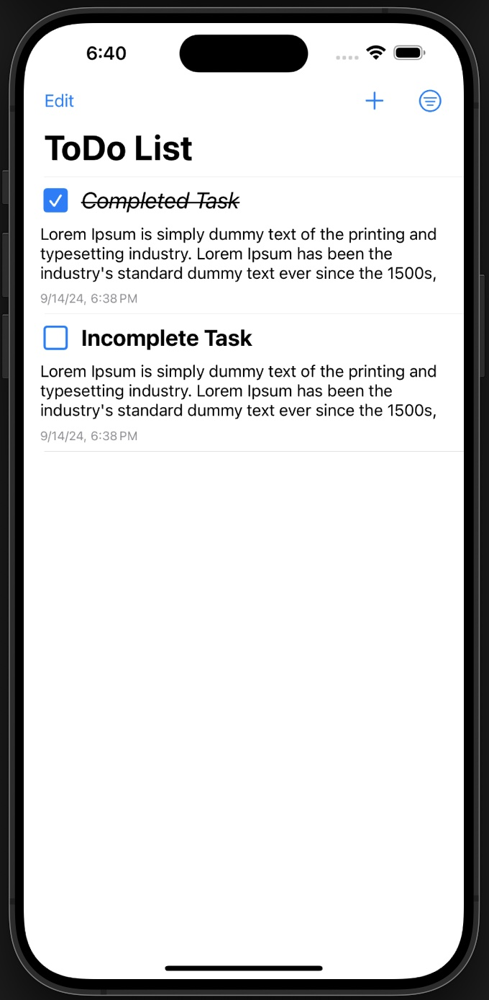

# To Do App ✅

1. Create a new to do task. Set it's title and description:


2. The to do list. User can hit the checkbox to mark the task as complete:


3. Edit existing task and save:


## Motivation

The ToDoApp is intended to store and track the user's tasks. The app is designed to display a list of tasks and their completion status.

## Features

1. **Differentiate Tasks**: Users can mark their tasks as complete. This creates a strike on the task's label.

2. **Local Data Persisting**: Uses Apple's Core Data framework to persist user's data across sessions.

3. **Light and Dark Mode Support**: Ensures a consistent and pleasing user experience in both light and dark modes.

## Setup Instructions

1. Clone the repository:
   ```bash
   git clone https://github.com/bsshanky/ToDoApp.git
   ```
   
2. Navigate to the project directory:
    ```
    cd Desserts
    ```
    
3. Open the project in Xcode:
    ```
    open ToDoApp.xcodeproj
    ```
    
4. Build and run the project on your chosen simulator or device.

## Acknowledgements

I would like to extend my sincere gratitude to the recruitment team at Airvet for providing me with this opportunity to work on this take-home assignment. It has been an invaluable learning experience.
